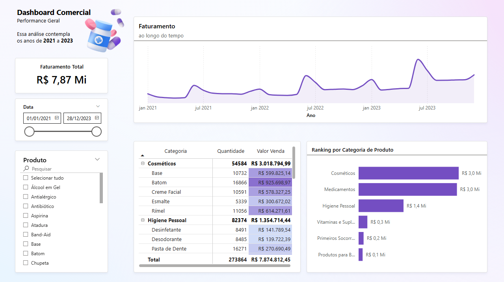

# Dashboard Comercial – Performance Geral

Este projeto apresenta um **Dashboard Comercial** desenvolvido em **Power BI**, com base em dados de vendas de uma farmácia entre **2021 e 2023**.  
O objetivo é analisar o desempenho geral, identificar tendências de faturamento e comparar categorias de produtos.

---

## Objetivos do Projeto
- Conectar e tratar dados de vendas a partir de uma planilha Excel.
- Realizar modelagem e relacionamento entre tabelas no Power BI.
- Criar medidas e métricas relevantes para análise.
- Estruturar um dashboard claro, bonito e profissional.
- Aplicar boas práticas de design e hierarquia visual.

---

## Estrutura do Repositório

📂 farmacia-sales-dashboard

┣ 📂 data

┃ ┗ historico_vendas_farmacia.xlsx  (base de dados usada)

┣ 📂 dashboard

┃ ┗ dashboard.pbix                   (arquivo do Power BI)

┗ 📂 images

┃ ┗ dashboard_preview.png           (print do dashboard)

---

## Principais Insights
**Faturamento Total Relevante**
O período de 2021 a 2023 gerou R$ 7,87 milhões, mostrando a força comercial da farmácia.
**Categorias Líderes em Receita**  
Cosméticos e Medicamentos são os grandes motores do faturamento, cada um com cerca de R$ 3 milhões, representando juntos mais de 70% da receita total.
**Volume vs. Ticket Médio**  
Medicamento tem o maior volume de unidades vendidas (108 mil), com faturamento de (R$ 2,96 milhão).
**Produtos Destaques**
Dentro de Cosméticos, o Batom lidera em faturamento (R$ 925 mil), enquanto em Higiene Pessoal o Desinfetante e a Pasta de Dente se destacam como essenciais de alto giro.
**Tendência Temporal com Picos**
O faturamento mostra crescimento consistente, com picos em meados de 2022 e início de 2023, sugerindo sazonalidade ou campanhas promocionais que impulsionaram as vendas.

---

## 🛠️ Tecnologias Utilizadas
- **Power BI Desktop**
- **Excel (base de dados)**
- **Power Query** para tratamento de dados
- **DAX** para criação de medidas

---

## 📸 Preview

---

## 📥 Como visualizar
1. Baixe o arquivo `dashboard.pbix`.
2. Abra no **Power BI Desktop** (gratuito).
3. Explore os filtros de data e produto para diferentes análises.

---

## ✨ Créditos
Projeto desenvolvido como prática após aula da **Leticia Smirelli** no YouTube.

